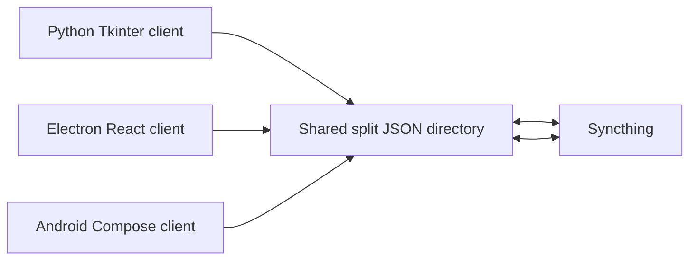

# Finance Tracker

Finance Tracker is a personal finance application for recording transactions, planning budgets, tracking savings and assets, and reviewing financial trends. It is implemented as a multi-client monorepo:

- A Python desktop client built with Tkinter.
- A modern Windows-oriented desktop client built with Electron, React, TypeScript, Vite, Tailwind, and Recharts.
- An Android client built with Kotlin, Jetpack Compose, Material 3, and Android's Storage Access Framework.

All clients operate on the same human-readable JSON data directory. Syncthing can synchronize that directory between computers and Android devices. The application does not use a server or database for normal operation.

> [!info] Core design
> The shared data directory is the product's integration boundary. Each client has its own UI and implementation of the domain calculations, but all clients read and write the split JSON file contract defined in `shared/finance_data_schema.md`.

## Project Goals

The project is designed for a user who wants to:

- Record expenses and income quickly.
- Separate recurring financial commitments from flexible transactions.
- Track daily spending capacity instead of only monthly totals.
- Understand spending by category and over time.
- Track bank, wallet, savings, investments, and money lent.
- Set and fund savings goals.
- Project future balances using a savings target or historical net-worth trend.
- Reconcile manually recorded transactions against bank CSV exports.
- Use one data set from desktop and Android without a hosted backend.

## Technology Stack

### Python desktop

- Python 3.
- Tkinter and `ttk` for the GUI.
- Matplotlib for charts.
- NumPy, used by the charting stack and installed as a project dependency.
- `python-dateutil` for month and date calculations.
- Standard-library JSON, filesystem, UUID, CSV, and HTTP modules for persistence and integrations.

The entry point is `run.py`. It calls `finance_tracker.app.main()`, which creates the Tk root window, constructs `AppState`, creates `MainView`, and starts Tkinter's event loop.

### Modern desktop

- Electron 43.1.
- React 19.2.
- TypeScript 7.
- Vite through `electron-vite`.
- Tailwind CSS through the Vite plugin.
- Recharts for charts.
- Radix UI Dialog for dialog behavior.
- Lucide React for icons.
- Vitest and Testing Library for unit and component tests.
- Playwright for Electron end-to-end tests.
- Electron Builder with an NSIS Windows installer.

The modern desktop app separates filesystem access from the renderer process. The Electron main process owns `DataStore`, the preload script exposes a narrow typed `window.finance` API, and React renders the application UI.

### Android

- Kotlin 2.4.
- Android Gradle Plugin 9.2.1.
- Compile SDK 35 and target SDK 35.
- Minimum SDK 26.
- Jetpack Compose with the Compose BOM.
- Material 3 and extended Material icons.
- AndroidX Navigation Compose.
- AndroidX Lifecycle Compose and ViewModel.
- AndroidX DataStore Preferences for the selected directory permission.
- Kotlinx Serialization JSON for JSON parsing and preservation.
- JUnit 4 for unit tests.

The Android application ID is `com.peterle95.financetracker` and the current version is `0.1.0` with version code `1`.

## Repository Layout

```text
run.py                              Python desktop entry point
finance_tracker/                    Python application package
  app.py                            Tkinter startup
  state.py                          Shared state and split persistence
  services/                         Budget, report, goal, asset, AI, and reconciliation logic
  ui/                               Main window, styling, charts, shortcuts, and tabs
tests/                              Python persistence tests

modern-desktop/
  src/main/                         Electron main process and filesystem access
  src/preload/                      Context-isolated renderer bridge
  src/renderer/                     React application and screens
  src/shared/                       TypeScript models, calculations, and reconciliation
  tests/e2e/                        Playwright desktop tests

android/
  app/src/main/java/.../data/       Repository, SAF, codec, and directory persistence
  app/src/main/java/.../domain/     Kotlin models and financial calculations
  app/src/main/java/.../ui/         Compose navigation, ViewModel, and screens
  app/src/test/                     Android unit tests

shared/
  finance_data_schema.md            Authoritative shared data contract
  categories.json                   Category registry in the development data set
  budget.json                       Budget owner file
  net_worth.json                    Net-worth owner file
  loans.json                        Loan owner file
  savings_goals.json                Savings-goal owner file
  preferences.json                  Shared defaults and preferences
  transactions_*.json               Category-owned transaction arrays

docs/                               Project, domain, research, and agent documentation
```

## Architecture

### Overall flow



Each client loads a logical finance document into memory, lets the user edit it through its UI, and writes only the relevant JSON files back to the selected directory. The clients do not call one another.

### Python architecture

```text
run.py
  -> finance_tracker.app.main()
  -> AppState
      -> split-directory load or legacy migration
      -> in-memory expenses, incomes, categories, and settings
  -> MainView
      -> Tkinter tabs
      -> domain/service calculations
      -> AppState.save()
          -> desired split files
          -> changed-file detection
          -> same-directory atomic replacement
```

`AppState` is the central application state and persistence boundary. It handles:

- Data-directory selection from environment variables.
- Initial creation of default data.
- Migration from the legacy monolithic `finance_data.json` format.
- Reading and writing the split files.
- Category creation, rename, deletion, and transaction movement.
- UUID assignment for transactions without IDs.
- Unknown-field preservation.
- Detection of orphan transaction files and synchronization conflict files.
- Same-directory temporary writes followed by flush, `fsync`, and replacement.

The Tkinter main window uses tabs for the user-facing features and a `ShortcutManager` for keyboard navigation and actions. The default window is 1250 by 750 pixels with a 1250 by 750 minimum size. It supports dark and light themes.

Python tabs are Add Transaction, View Transactions, Charts/Reports, Settings, Budget Report, Budgets Limits, Savings Goals, Net Worth, Projection, AI Insights, and Reconciliation. Useful shortcuts include `Ctrl+A` for Add Transaction, `Ctrl+V` for View Transactions, `Ctrl+R` for Reports, `Ctrl+B` for Budget Report, `Ctrl+L` for Budget Limits, `Ctrl+G` for Savings Goals, `Ctrl+P` for Projection, `Ctrl+S` to save the active form or settings, `Ctrl+N` for a new transaction, `Ctrl+E` to edit, `Ctrl+D` or `Delete` to delete, `F5` to refresh, `Ctrl+F` to focus filtering, and `Ctrl+H` or `F1` for help.

### Modern desktop architecture

```text
Electron main process
  -> DataStore
  -> IPC handlers
  -> contextBridge preload API: window.finance
  -> React App
  -> feature screen
  -> persist(next document)
  -> DataStore.saveDocument(previous, next)
  -> changed split JSON files
```

Important boundaries:

- `src/main/index.ts` creates the BrowserWindow and registers IPC handlers.
- `src/main/data-store.ts` selects directories, migrates legacy data, reads the split contract, and saves changes.
- `src/main/file-utils.ts` writes JSON through a same-directory temporary file and rename.
- `src/preload/index.ts` exposes only typed finance operations to the renderer.
- `src/renderer/App.tsx` owns loaded document state, navigation, saving state, connection status, theme, and dialogs.
- `src/shared/finance.ts` owns normalization and most calculations used by the renderer.
- `src/shared/reconciliation.ts` parses bank CSV text for the renderer-side reconciliation flow.

The renderer has no direct Node.js filesystem access. `contextIsolation` is enabled and `nodeIntegration` is disabled. Saves are serialized by a process-local queue, and the UI rolls back to the previous document when a save fails.

### Android architecture

```text
MainActivity
  -> FinanceApp Compose root
  -> Navigation Compose
  -> FinanceViewModel
  -> FinanceRepository
  -> FinanceDirectoryStore
  -> SafFinanceDirectory
  -> Android Storage Access Framework provider
```

- `FinanceApp.kt` defines the Compose scaffold, top bar, bottom navigation, routes, and reload-on-resume behavior.
- `FinanceViewModel.kt` validates user input, exposes `StateFlow` values, and emits snackbar messages.
- `FinanceRepository.kt` is the application data boundary and protects mutations with a Kotlin `Mutex`.
- `FinanceDirectoryStore.kt` reads and writes the split directory, performs migration, handles category-owned transaction files, and preserves JSON extensions.
- `SafFinanceDirectory.kt` implements directory access through Android document providers.
- `SettingsDataStore.kt` persists the selected tree URI and its read/write permission.
- `FinanceJsonCodec.kt` converts JSON into domain models and writes known fields while retaining extra JSON fields.

The Android UI reloads the selected directory when the application resumes. This is important when Syncthing has changed files while the application was not in the foreground.

## Shared Data Model

### Live directory contents

The live data set is a complete directory, not one file:

```text
categories.json
budget.json
net_worth.json
loans.json
savings_goals.json
preferences.json
transactions_expense_<file_key>.json
transactions_income_<file_key>.json
```

All files are UTF-8 JSON. Dates use `YYYY-MM-DD`. Money values are JSON numbers, normally displayed as euros by the clients.

`categories.json` is both the category registry and the migration-completion marker. It defines which transaction files are expected to exist. A category entry has a display `name` and a stable kebab-case `file_key`:

```json
{
  "Expense": [
    { "name": "Food", "file_key": "food" }
  ],
  "Income": [
    { "name": "Salary", "file_key": "salary" }
  ]
}
```

The `file_key` is generated once. Renaming a category changes its display name but keeps its file identity. If a generated key collides, the clients use suffixes such as `food-2` and `food-3`.

### Transactions

Each transaction file contains an array of objects:

```json
[
  {
    "id": "075b20b7-2a31-4ea9-b8ec-31fe6466de62",
    "date": "2026-07-01",
    "amount": 25.5,
    "category": "Food",
    "description": "Lunch",
    "behavior_date": "2026-06-16"
  }
]
```

Fields:

- `id`: stable transaction identity, normally a UUID.
- `date`: booking date used by normal month calculations.
- `amount`: positive numeric amount.
- `category`: current display category.
- `description`: free-text description.
- `behavior_date`: optional real-world spending date, primarily for buy-now-pay-later expenses.
- Unknown fields: extensions retained by the persistence implementations wherever possible.

### BNPL date convention

Buy-now-pay-later transactions deliberately have two dates:

- `date` is the first day of the following month, representing when the expense is booked.
- `behavior_date` is the actual day on which the purchase happened.

For a purchase made on `2026-06-16`, the stored transaction is:

```json
{
  "date": "2026-07-01",
  "behavior_date": "2026-06-16"
}
```

Normal month filters use `date`. Reports that are configured to use behavior dates use `behavior_date` and fall back to `date` when it is missing.

### Budget owner file

`budget.json` owns:

- `monthly_income`: recurring income sources with amount, description, start date, and optional end date.
- `fixed_costs`: recurring costs with amount, description, start date, and optional end date.
- `daily_savings_goal`: amount to reserve per day.
- `category_budgets`: percentage maps for expense and income categories.

Recurring income and fixed costs are active in every month whose date range overlaps the entry's start and end dates. A null `end_date` means the entry remains active.

The older format allowed `monthly_income` to be a single number. Readers accept it and normalize it to an always-active base income source when writing.

### Net-worth owner file

`net_worth.json` owns current balances and historical asset snapshots:

- Bank account balance.
- Wallet balance.
- Savings balance.
- Investment balance.
- Money lent balance.
- Cash balance as a schema-compatible field.
- Dated `asset_snapshots`.

Current net worth is calculated as:

```text
bank account
+ wallet
+ savings
+ investments
+ money lent
= current net worth
```

An asset snapshot records those balances, a date, an optional note, and the calculated net worth. Recording a snapshot for an existing date replaces that date's snapshot.

### Loans and savings goals

`loans.json` stores money lent to another person. A loan has a stable ID, borrower, amount, description, notes, and date. Loan operations can also update `money_lent_balance` in `net_worth.json`.

`savings_goals.json` stores goals with:

- Name and description.
- Target amount.
- Allocated amount.
- Priority: High, Medium, or Low.
- Optional target date.
- Created and completion dates.

Goal progress is the allocated amount divided by the target amount. The app can estimate completion from the historical average monthly allocation, calculate the monthly amount needed for a target date, validate allocations against available savings, and automatically distribute unallocated savings by priority and need.

### Preferences

`preferences.json` stores shared behavior and range defaults, including:

- Include-negative-carryover behavior.
- Projection mode.
- Report view and report type.
- Transaction-date versus behavior-date reporting.
- Historical report mode and display format.
- Whether recurring income and costs are included in reports.
- Projection horizon, projection history, carryover history, and report history ranges.

Clients treat these as shared hints. A client preserves settings it does not understand.

## Features

### Transaction management

All clients support the core transaction model:

- Add expense or income.
- Select a category.
- Enter date, amount, and description.
- Optionally create a BNPL expense.
- Edit a transaction by stable ID.
- Delete a transaction.
- Filter and sort transactions.
- Move a transaction between categories.

Category changes are storage operations, not only UI label changes. Renaming a category updates its registry record, its owned transaction rows, and matching category-budget keys. Deleting a populated category is blocked. New categories receive a new transaction file.

### Budget planning

The budget feature combines:

- Active recurring income.
- Flexible income transactions.
- Active fixed costs.
- Flexible expense transactions.
- Daily savings goals.
- Optional negative carryover.
- Category percentage limits.

The basic flexible budget is:

```text
active base income
+ flexible income
- active fixed costs
- daily savings goal * days in month
= net available flexible spending
```

The daily budget report walks through the month day by day. It adds income on its booking date, subtracts expenses on their booking date, recalculates the remaining daily target, and reports whether the user is on track, overspending, or has depleted the flexible budget.

Category limits can be entered manually. Auto-assignment uses recorded spending: if spending is within the available flexible budget, percentages reflect spending against the available budget; if spending exceeds the budget, percentages are normalized against total spending.

### Reports and charts

Reports can use expenses or income and can cover one month or a range. Supported views include:

- Category pie breakdown.
- Historical monthly totals.
- Category history lines.
- Flexible income versus flexible costs.
- Total income versus total expenses.
- Day-of-week spending heatmap.
- Spending pace for the current month.

Reports can optionally include recurring fixed costs or base income. The modern desktop client and Android shared defaults support selecting transaction date or behavior date as the report basis.

The Python client renders charts with Matplotlib. The modern desktop client renders charts with Recharts. The Android client currently focuses on dashboard and financial summaries rather than exposing the full desktop report navigation.

### Net worth and assets

The net-worth feature provides:

- Current asset balances.
- Current net worth.
- Asset allocation across bank, wallet, savings, investments, and money lent.
- Historical dated snapshots.
- Changes over one, three, six, and twelve months when history exists.
- Snapshot history reports and charts.

The Python client also includes asset breakdown and historical chart generation. The modern desktop client provides a dedicated Net Worth screen. Android provides a Net Worth screen and snapshot operations.

### Projections

Two projection models are available:

1. **Target savings projection**
   - Starts from current net worth.
   - Adds the daily savings goal multiplied by the days in each projected month.
   - Produces projected monthly savings and future balance rows.

2. **Net-worth trend projection**
   - Requires at least two asset snapshots.
   - Calculates changes between consecutive snapshots.
   - Averages a configurable number of recent changes.
   - Applies that average change to future months.

The projection is an estimate, not a forecast backed by bank data or investment-market data.

### Bank CSV reconciliation

The Python and modern desktop clients can import bank CSV exports, with particular support for German bank formats such as Sparkasse, DKB, and N26 exports.

The parser:

- Detects UTF-8, UTF-8 with BOM, Latin-1, and CP1252 encodings.
- Detects semicolon, comma, and tab separators.
- Maps common German and generic date, amount, payee, purpose, booking-text, and currency columns.
- Parses German amounts such as `1.234,56` and `-89,25`.
- Parses German dates such as `20.04.26` and `20.04.2026`.
- Classifies positive amounts as income and negative amounts as expense.

Matching compares imported rows with manually recorded transactions using:

- Amount equality within a small rounding tolerance.
- Exact date matching.
- Possible matching when the date is within three days.
- A used-ID set to avoid matching one manual transaction more than once.

Category suggestions first use similar historical descriptions, then keyword rules, and finally the last available category, normally `Other`. Reconciliation is a review aid; importing a CSV does not automatically create every missing transaction.

### Optional AI insights

The Python client contains an optional AI Insights feature. It aggregates a selected month range into category totals, fixed costs, base income, flexible income, flexible expenses, totals, and transaction counts. It can generate a financial-coach prompt or a chat prompt and send it through a configurable HTTP API.

Supported request styles in the Python service are:

- Google Generative Language-style requests.
- OpenAI-compatible chat-completion-style requests.

Configuration contains a provider, API base URL, API key, and model. The modern desktop README explicitly lists AI Insights as deferred, so this capability should be treated as Python-client-specific rather than a cross-client feature.

## Client Feature Matrix

| Capability | Python desktop | Modern desktop | Android |
|---|---:|---:|---:|
| Add, edit, delete transactions | Yes | Yes | Yes |
| BNPL booking date | Yes | Yes | Yes for expenses |
| Category management | Yes | Yes | Yes |
| Transaction filtering and sorting | Yes | Yes | Yes |
| Recurring income and fixed costs | Yes | Yes | Yes |
| Daily budget and carryover | Yes | Yes | Yes |
| Category limits | Yes | Yes | Shared data support; no dedicated screen |
| Savings goals | Yes | Yes | Yes |
| Loans / money lent | Yes | Yes | Yes |
| Net worth and snapshots | Yes | Yes | Yes |
| Target projection | Yes | Yes | Yes |
| Net-worth trend projection | Yes | Yes | Domain support exists |
| Pie, history, line, pace, weekday reports | Yes | Yes | Not exposed as desktop-style report navigation |
| Bank CSV reconciliation | Yes | Yes | No dedicated screen |
| Text report export | Yes | Yes | Not a primary exposed workflow |
| AI insights | Yes, optional | Deferred | Not exposed |
| Syncthing shared directory | Environment path | Directory picker or environment path | SAF directory picker |

The clients are intentionally not identical UIs. The shared contract is the compatibility target; feature screens and some calculations are implemented separately in Python, TypeScript, and Kotlin.

## Installation and Running

### Python desktop

Create a virtual environment and install dependencies:

```bash
python -m venv venv
source venv/bin/activate
pip install -r requirements.txt
python run.py
```

On Windows PowerShell:

```powershell
python -m venv venv
venv\Scripts\activate
pip install -r requirements.txt
python run.py
```

By default, Python uses the repository's `shared/` directory. For a Syncthing directory, set `FINANCE_DATA_DIR` before starting:

```powershell
$env:FINANCE_DATA_DIR = "C:\Users\Peter\Syncthing\FinanceTrackerData"
python run.py
```

```bash
export FINANCE_DATA_DIR="$HOME/Syncthing/FinanceTrackerData"
python run.py
```

`FINANCE_DATA_FILE` exists only for locating a legacy monolithic file during migration. New installations should use `FINANCE_DATA_DIR`.

### Modern desktop

```powershell
cd modern-desktop
npm install
npm run dev
```

On first launch:

1. Choose **Choose data directory** for an existing split directory.
2. Choose **Create in directory** for a new empty directory.
3. If the directory contains only a legacy `finance_data.json`, allow the app to migrate it.
4. Use Settings to change the connected directory or reload it.

The selected directory is remembered in the Electron user-data directory. `FINANCE_DATA_DIR` can be used for development and automation.

The repository contains a packaged Windows installer in `modern-desktop/release/` when a package has been built. The package command generates an NSIS installer and places it in that release directory.

### Android

Open `android/` in Android Studio, allow Gradle synchronization, and run the `app` configuration on an Android 8.0 / API 26 or newer device or emulator.

After launching:

1. Open Settings.
2. Select **Connect synced directory**.
3. Choose the directory containing the complete split JSON file set through Android's directory picker.
4. Grant persistent read and write access.
5. Return to the app. It loads the directory and displays synchronization warnings or errors through the UI.

Choose the directory, not a single JSON file. The app persists the tree URI and reloads on startup, resume, or manual reload.

## Syncthing Setup

Recommended setup:

1. Create a Syncthing folder such as `FinanceTrackerData`.
2. Enable Syncthing file versioning for that folder.
3. Place the complete split file set directly in the folder.
4. Point Python to the folder with `FINANCE_DATA_DIR`.
5. Select that same directory in the modern desktop client.
6. Select that same directory through Android's directory picker.
7. Let Syncthing finish before editing from another client.

Do not synchronize only `finance_data.json`. It is a legacy migration input and not the live data set after migration. If the selected directory contains a legacy file but no `categories.json`, a client performs one-time migration and leaves the legacy file untouched as a recovery copy.

## First-Use Workflow

For a new installation:

1. Create or select an empty data directory.
2. Let the first client create default categories and owner files.
3. Review or rename the default expense and income categories.
4. Add recurring income sources and fixed costs with their active date ranges.
5. Enter current bank, wallet, savings, and investment balances.
6. Set a daily savings goal if desired.
7. Add savings goals and allocate part of the savings balance.
8. Record transactions as they happen.
9. Review the Dashboard and Budget views during the month.
10. Record an asset snapshot periodically, such as at month end.
11. Use Reports and Projection after enough history has accumulated.
12. Reconcile against a bank CSV when reviewing a statement period.

For an existing installation, connect every client to the same directory and allow the first client to migrate legacy data if necessary. Never manually rename category transaction files; rename categories through a client so the registry and file ownership remain consistent.

## Daily Usage

### Record a normal expense

1. Open Add Transaction or the transaction editor.
2. Select `Expense`.
3. Enter the actual booking date, amount, category, and description.
4. Save.

The transaction receives a stable ID and is written to the transaction file owned by the selected category.

### Record income

1. Open Add Transaction.
2. Select `Income`.
3. Enter the date, amount, category, and description.
4. Save.

Recurring base income should be configured as a monthly income source in Budget. Irregular income should be recorded as an income transaction.

### Record a BNPL expense

1. Select an expense transaction flow.
2. Enter the real purchase date.
3. Enable the BNPL or pay-next-month option.
4. Save.

The client stores the first day of the following month in `date` and preserves the real purchase date in `behavior_date`. Use the transaction-date report basis for booking-month analysis and the behavior-date basis for actual-spending analysis.

### Manage categories

Create categories only through the application. When renaming, the storage file key remains stable. Before deleting a category, move or delete every transaction that belongs to it. The clients intentionally refuse to delete a category with a populated transaction file.

### Review budget status

Select the month in the Budget view. Check:

- Base income active during that month.
- Flexible income transactions.
- Fixed costs active during that month.
- Daily savings reservation.
- Negative carryover, if enabled.
- Remaining flexible budget.
- Adjusted daily spending target.

The daily target is dynamic. Overspending on an earlier day reduces the amount available for later days; underspending leaves more available for the remaining days.

### Reconcile a bank statement

1. Export a bank statement as CSV.
2. Open Reconciliation in Python or modern desktop.
3. Import the CSV.
4. Review encoding, separator, skipped-row, and column-mapping information.
5. Inspect matched, possible, and missing rows.
6. Review category suggestions.
7. Add or correct manual transactions as needed.

The matching process is deliberately conservative. Exact amount and date matches are marked matched; amount matches with dates within three days are marked possible; unmatched rows are marked missing.

## Migration and Recovery

### Legacy migration

The legacy format is one `finance_data.json` object containing expenses, incomes, categories, and `budget_settings`. Migration occurs only when `categories.json` is absent and the legacy file exists.

Migration steps are:

1. Read the legacy object.
2. Preserve unknown root, settings, category, and transaction fields.
3. Assign UUIDs to transactions without IDs.
4. Add categories referenced by transactions but absent from the category list.
5. Create category registry records and split transaction files.
6. Split budget, net worth, loan, savings-goal, and preference ownership.
7. Reconstruct the logical document from the new files.
8. Compare it semantically with the source document.
9. Write `categories.json` last as the migration completion marker.

The legacy file is not modified or deleted. If verification fails, the client withholds or removes `categories.json` and reports the failure. Partial files should be inspected or restored using Syncthing versioning before retrying.

### Warnings and invalid files

- A missing registered transaction file is recreated as an empty array.
- A missing static owner file can stop modern desktop and Android loading; Python currently supplies defaults and rewrites it.
- An orphan transaction file is retained, ignored, and reported.
- A Syncthing conflict copy is retained, ignored, and reported.
- Invalid JSON or an incorrect root type blocks the affected file from loading.
- Clients do not automatically merge conflict copies.

Resolve conflicts by inspecting the normal file and conflict version, selecting the correct data manually, and removing or archiving the conflict copy only after recovery. Use Syncthing versioning as the primary recovery mechanism.

## Persistence and Concurrency Limits

The project has per-file safety measures, but it is not a transactional database.

There is no:

- Cross-file database transaction.
- Cross-client lock.
- Compare-and-swap protocol.
- Automatic conflict merge.

Python writes a temporary file in the same directory, flushes and syncs it, and replaces one target file. Modern desktop writes a temporary file and renames it over one target file, with a save queue inside that process. Android writes through the Storage Access Framework and rereads the document to verify the result, but Android document providers do not provide the same atomic rename behavior.

Category changes, transaction moves, migrations, loan updates, and loan-to-net-worth updates can touch multiple files. An interruption between those writes can leave a partial operation. Avoid editing the same data from two clients at the same time, wait for Syncthing to settle before switching devices, and keep versioning enabled.

## Development Commands

### Python

```bash
pip install -r requirements.txt
python run.py
python -m unittest tests.test_persistence
```

### Modern desktop

```powershell
cd modern-desktop
npm install
npm run typecheck
npm test
npm run build
npm run test:e2e
npm run package:win
```

The scripts are:

- `dev`: run Electron through electron-vite.
- `typecheck`: run TypeScript without emitting files.
- `test`: run Vitest once.
- `test:watch`: run Vitest interactively.
- `build`: typecheck and build Electron main, preload, and renderer outputs.
- `test:e2e`: build and run Playwright tests.
- `package:win`: build and create the Windows NSIS installer.

### Android

From the `android/` directory on Windows:

```powershell
.\gradlew.bat test assembleDebug
```

On Unix-like systems:

```bash
./gradlew test assembleDebug
```

The Android tests cover migration, JSON codec behavior, budget math, transaction date logic, aggregation, charts, net-worth math, projections, amount parsing, and split-directory persistence.

## Test Coverage

### Python tests

`tests/test_persistence.py` covers:

- Legacy migration without modifying the source file.
- Default initialization.
- Category creation, rename, and deletion protection.
- Missing registry safety.
- Per-file writes.
- Preservation of external edits.
- Environment-variable precedence.
- Transaction moves.
- Orphan and conflict warnings.
- Unknown-field preservation.
- Missing transaction-ID behavior.

### Modern desktop tests

The modern client includes:

- `src/main/data-store.test.ts` for migration, aliases, malformed data, missing files, owner-specific writes, category lifecycle, transaction moves, and warnings.
- `src/main/file-utils.test.ts` for atomic JSON write behavior.
- `src/shared/finance.test.ts` for BNPL, dates, budget calculations, carryover, recurring windows, snapshots, liabilities, goals, reports, and projections.
- `src/shared/reconciliation.test.ts` for CSV parsing and bank matching.
- React component tests for the application, transaction editor, transactions, budget, category limits, reports, and net worth screens.
- `tests/e2e/desktop.spec.ts` for launching Electron, migrating a legacy file, adding an expense, and opening key screens.

### Android tests

Android tests cover the corresponding persistence and domain behavior in Kotlin, including unknown-field retention, legacy migration, category lifecycle, external-row preservation, owner writes, missing/orphan/conflict file behavior, BNPL rules, budget calculations, dashboard charts, net-worth calculations, and projections.

## Important Technical Caveats

- The shared JSON directory is the source of truth; `finance_data.json` is migration-only after migration.
- Do not sync or select only one JSON file.
- Do not manually rename transaction files.
- Transaction IDs are important for reliable edits and deletes across clients.
- Category display names are mutable, but category `file_key` values must remain stable.
- Unknown JSON fields are part of the compatibility strategy and should not be discarded.
- Per-file writes do not make multi-file operations atomic.
- Syncthing conflict and orphan warnings require human review.
- The clients implement some calculations independently, so exact behavior should be verified in the affected client's tests when changing domain logic.
- Android currently has no dedicated bank reconciliation screen.
- Modern desktop lists AI Insights as deferred.
- Projection results are mathematical scenarios, not guaranteed financial predictions.
- The current Python client defaults to the repository `shared/` directory when no environment path is configured, so avoid entering personal data there unintentionally.

## Key Source Files

| File | Responsibility |
|---|---|
| `run.py` | Python entry point |
| `finance_tracker/state.py` | Python state, migration, categories, persistence |
| `finance_tracker/ui/main_view.py` | Python tab layout and shortcuts |
| `finance_tracker/services/budget_calculator.py` | Budget and daily spending calculations |
| `finance_tracker/services/report_builder.py` | Python report data |
| `finance_tracker/services/projection_service.py` | Python projections |
| `finance_tracker/services/goals_service.py` | Savings-goal calculations |
| `finance_tracker/services/asset_tracking_service.py` | Net-worth and snapshot calculations |
| `finance_tracker/services/reconciliation_service.py` | German bank CSV parsing and matching |
| `finance_tracker/services/ai_insights_service.py` | Optional HTTP AI insights |
| `modern-desktop/src/main/data-store.ts` | Electron split-directory persistence |
| `modern-desktop/src/main/index.ts` | Electron main process and IPC |
| `modern-desktop/src/preload/index.ts` | Typed renderer bridge |
| `modern-desktop/src/renderer/App.tsx` | React state, navigation, and saves |
| `modern-desktop/src/shared/finance.ts` | TypeScript normalization and calculations |
| `android/.../FinanceRepository.kt` | Android data boundary and synchronization state |
| `android/.../FinanceDirectoryStore.kt` | Android split-directory persistence |
| `android/.../FinanceJsonCodec.kt` | Android JSON model conversion |
| `android/.../FinanceViewModel.kt` | Android validation and UI actions |
| `android/.../FinanceApp.kt` | Android Compose navigation |
| `shared/finance_data_schema.md` | Authoritative cross-client contract |

## Short Operational Summary

Finance Tracker is a local-first personal finance system. Run one of the clients, connect it to a complete shared data directory, record transactions and recurring financial data, review budgets and reports, and let Syncthing replicate the directory to other devices. Use the desktop clients for the broadest reporting and reconciliation workflows, and use Android for mobile transaction entry, budget review, net worth, goals, projections, and synchronized directory access.
