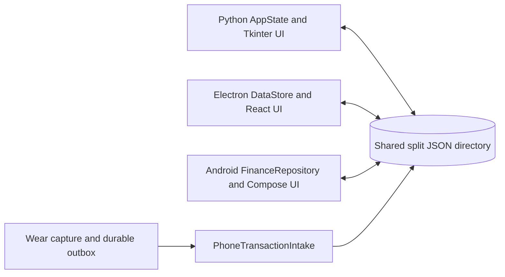

# System architecture

The repository implements parallel clients over the same split JSON directory. Python starts at `run.py` → `finance_tracker.app.main` → `AppState` and `MainView`; Electron starts in `modern-desktop/src/main/index.ts`, exposes a narrow preload API, and renders React screens; Android starts at `MainActivity`/`FinanceApp`, while Wear capture uses a separate module and a versioned protocol.

The directory is the integration boundary, not a database server. Each client normalizes input, preserves unknown fields, and writes owner files. The watch is different: it sends protocol messages to the phone, which validates and idempotently commits the transaction to the directory. Feature-specific details belong in [the data contract](../data-contract/index.md), [Android](../android/index.md), and [the transaction lifecycle](../workflows/transaction-lifecycle.md).

## Electron process boundary

`modern-desktop/src/main/index.ts` is the Electron composition root. After `app.whenReady()`, it creates one `DataStore`, registers the `finance:*` IPC handlers, and creates a `BrowserWindow` with `contextIsolation: true` and `nodeIntegration: false`. `modern-desktop/src/preload/index.ts` is the shipped consumer boundary: it maps the typed `FinanceApi` operations to those handlers and exposes only `window.finance` through `contextBridge`. Renderer changes should use that API rather than importing Node or Electron modules.

The main process owns filesystem dialogs, the remembered user-data configuration, CSV decoding/import, report export, and all persistence. This boundary is connected to [Electron DataStore](../modern-desktop/data-store.md), while the shared types and formulas are documented in [the modern desktop domain](../modern-desktop/domain.md).

**Change navigation:** change IPC behavior in `src/main/index.ts`, update the corresponding `FinanceApi` and preload mapping in `src/shared/types.ts` and `src/preload/index.ts`, then update renderer consumers and tests. The narrow check is `npm run typecheck` from `modern-desktop`; run the relevant Vitest suite for behavior, and use `npm run build` when the shipped Electron bundle or preload contract changes.
