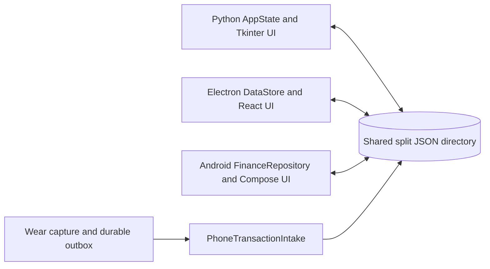

# System architecture

The repository implements parallel clients over the same split JSON directory. Python starts at `run.py` → `finance_tracker.app.main` → `AppState` and `MainView`; Electron starts in `modern-desktop/src/main/index.ts`, exposes a narrow preload API, and renders React screens; Android starts `MainActivity`/`FinanceApp`, while Wear capture uses a separate module and a versioned protocol.

The directory is the integration boundary, not a database server. Each client normalizes input, preserves unknown fields, and writes owner files. The watch is different: it sends protocol messages to the phone, which validates and idempotently commits the transaction to the directory. Feature-specific details belong in [the data contract](../data-contract/index.md), [Android](../android/index.md), and [the transaction lifecycle](../workflows/transaction-lifecycle.md).
