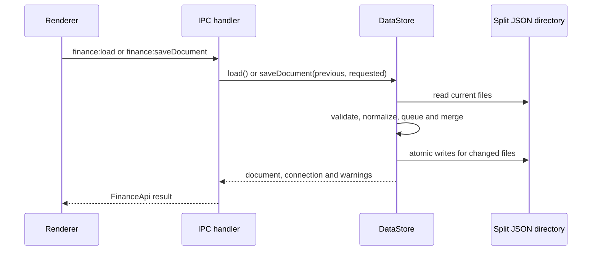

# Electron DataStore

`DataStore.load` resolves the remembered directory, initializes or migrates it, reads owner files and category transaction files, and returns a document plus connection warnings. `saveDocument` chains operations on `saveQueue`; `saveDocumentNow` compares the requested document with the previous one, rejects arbitrary simultaneous category and transaction changes, calls `saveCategoryChanges`, merges transaction edits against the latest on-disk category files, then writes changed `budget.json`, `net_worth.json`, `preferences.json`, `loans.json`, and `savings_goals.json` before rereading. `writeJsonAtomically` protects each file, not multi-file operations.

*The main-process persistence and IPC sequence is implemented by `src/main/index.ts`, `src/preload/index.ts`, and `src/main/data-store.ts`.*

Category renames retain their existing `file_key`; additions allocate a slug and an empty array; populated-category deletion is rejected. Save operations must separate category edits from unrelated transaction edits, except for the explicitly supported rename-only transaction transformation. The queue serializes callers, and transaction saves reread the latest category files so another client’s changes are not overwritten unnecessarily. Missing `categories.json` migrates legacy input or rejects a non-empty incomplete directory. Invalid JSON, non-object categories, invalid names/keys, duplicate names/keys, and non-object transaction rows return disconnected load errors.

`findWarnings` reports conflict-named files and unregistered transaction files as warnings. `chooseBankCsv` opens a CSV, decodes UTF-8/Latin-1/CP1252, and delegates parsing; `exportText` writes a selected report file.

## Change navigation and validation

- Persistence rules and lifecycle: `modern-desktop/src/main/data-store.ts`, especially `DataStore.load`, `saveDocument`, `saveDocumentNow`, category-save helpers, and `readDirectory`.
- Atomic single-file replacement: `modern-desktop/src/main/file-utils.ts`; do not infer global atomicity across the split set.
- Public wiring: `modern-desktop/src/main/index.ts` registers handlers and `src/preload/index.ts` exposes `FinanceApi`; a persistence API change is incomplete until both internal tests and the consumer-facing typecheck/build pass.
- Focused tests: `src/main/data-store.test.ts` covers new-directory loading, malformed/incomplete directories, migration and verification, category add/rename/delete, queued saves and latest-file merging, orphan/conflict warnings, and owner-file persistence. `file-utils.test.ts` covers atomic replacement; reconciliation tests cover the CSV parser itself.
- Minimal checks: `npm test -- src/main/data-store.test.ts` and `npm run typecheck` from `modern-desktop`. Run `npm run build` conditionally when IPC/preload packaging or the shipped bundle changes; E2E and packaging are release-level checks, not default persistence validation.
