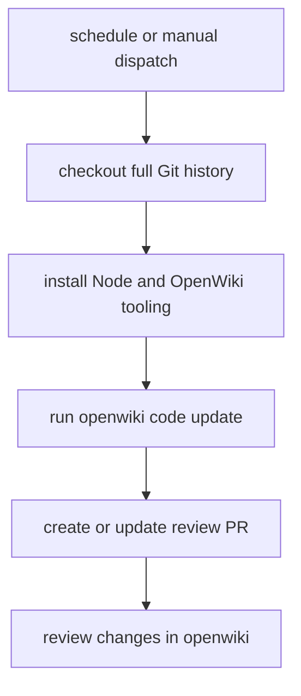

# Automation and release operations

`.github/workflows/openwiki-update.yml` runs manually or daily at `0 8 * * *`. The `update` job checks out full history with pinned `actions/checkout@34e114876b0b11c390a56381ad16ebd13914f8d5` (v4), installs Node 22 via pinned `actions/setup-node@49933ea5288caeca8642d1e84afbd3f7d6820020` (v4), and installs `openwiki@0.3.3`, `mermaid@11.16.0`, and `jsdom@29.1.1`. It runs `openwiki code --update --print` with provider `openai-chatgpt` and model `gpt-5.6-luna`, authenticated by the four `OPENAI_CHATGPT_*` secrets defined in the workflow. Full history is required so OpenWiki can compare HEAD with the commit recorded in `openwiki/.last-update.json`.

The job grants `contents: write` and `pull-requests: write`, then uses pinned `peter-evans/create-pull-request@22a9089034f40e5a961c8808d113e2c98fb63676` (v7) on branch `openwiki/update`. Its allowlist includes `openwiki`, `AGENTS.md`, `CLAUDE.md`, and `.github/workflows/openwiki-update.yml`; generated documentation therefore arrives as a reviewable PR rather than being applied directly to the default branch. Missing OAuth secrets, shallow history, provider failure, or permission errors require checking repository configuration and rerunning manually. Do not reproduce secret values in documentation or commits.

This flow shows the repository's automated documentation boundary: generation is authenticated by repository configuration, while publication remains a pull-request review step.

The modern desktop package scripts provide `typecheck`, Vitest, Playwright E2E, `build`, and `package:win`. Electron Builder emits a Windows NSIS installer under `modern-desktop/release/`; build output is `out/`. The narrow validation order is `npm run typecheck`, `npm test`, `npm run build`, then `npm run test:e2e`; package only for release artifacts. CI documentation changes arrive as a PR and can be repaired by rerunning the workflow with full history.
