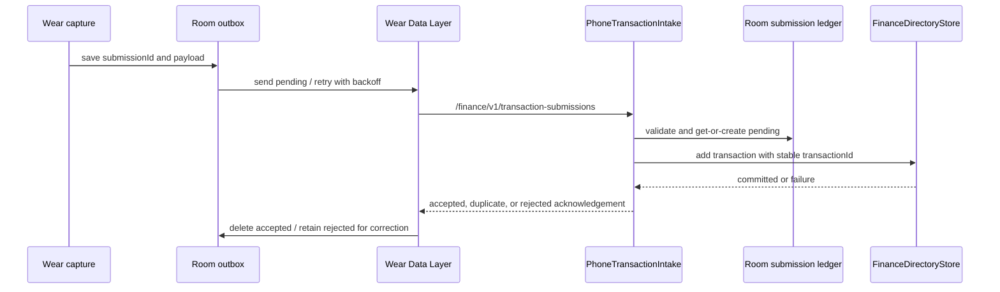

# Transaction lifecycle

Desktop clients create or edit rows in their UI, normalize them, and persist them in the category-owned transaction file. Category rename retains `file_key` and rewrites row category names; moves preserve IDs and unknown fields; deletion is blocked when the source file is populated. BNPL records use booking `date` and optional `behavior_date`.

`WatchOutbox` persists pending/rejected states in Room and migrates legacy SharedPreferences state. `WatchDelivery` retries when the phone capability is unavailable. `PhoneTransactionIntake` serializes calls with a mutex; the ledger makes repeated submission IDs duplicate-safe, rejects invalid payloads, and maps BNPL dates before writing. A write exception returns no acknowledgement, leaving retryable state. Rejected rows retain message/code for correction. Protocol paths and codecs live in [Wear protocol](../android/wear-protocol.md).

Evidence: `WatchDeliveryTest`, `PhoneTransactionIntakeTest`, `TransactionProtocolCodecTest`, Android directory-store tests, `tests/test_persistence.py`, and modern `data-store.test.ts`.
